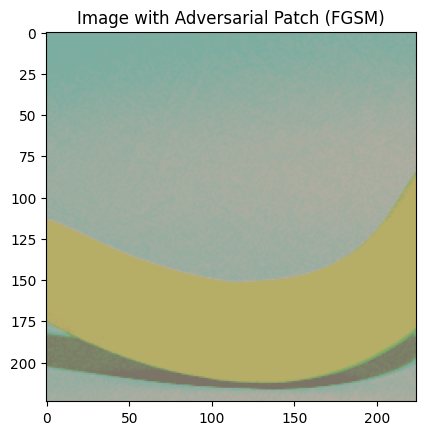

# XAI-Adversarial-Patch

This project demonstrates the implementation of adversarial patch attacks and Fast Gradient Sign Method (FGSM) attacks on deep learning models, specifically targeting ResNet34 architecture. The project explores how these attacks can manipulate model predictions and provides insights into model interpretability.

## Overview

The project implements two key adversarial attack methods:

1. **Adversarial Patches**: Small images that can cause deep learning models to misclassify input when placed on another image. These patches are:
   - Universal (work on any input image)
   - Physically printable
   - Location-independent
   - Optimized through gradient-based methods

2. **Fast Gradient Sign Method (FGSM)**: A technique that creates adversarial examples by perturbing input images in the direction that maximizes the loss function. The perturbation is controlled by the epsilon parameter:
   ```python
   perturbed_image = image + epsilon * sign(∇x J(θ, x, y))
   ```
   where J is the model's loss function.

## Requirements

- Python 3.10+
- PyTorch
- torchvision
- numpy
- matplotlib
- seaborn
- tqdm
- PyTorch Lightning

Install dependencies:
```bash
pip install torch torchvision numpy matplotlib seaborn tqdm pytorch-lightning
```

## Implementation Details

### Adversarial Patch Attack

The implementation uses several key techniques:

1. **Model Setup**:
```python
pretrained_model = torchvision.models.resnet34(weights='IMAGENET1K_V1')
pretrained_model.eval()  # Set to evaluation mode
for param in pretrained_model.parameters():
    param.requires_grad = False  # Freeze model weights
```

2. **Data Processing**:
- Uses TinyImageNet dataset
- Normalizes images using ImageNet statistics:
  ```python
  NORM_MEAN = [0.485, 0.456, 0.406]
  NORM_STD = [0.229, 0.224, 0.225]
  transforms = transforms.Compose([
      transforms.ToTensor(),
      transforms.Normalize(mean=NORM_MEAN, std=NORM_STD)
  ])
  ```

3. **Patch Initialization**:
```python
def initialize_patch(patch_size):
    # Initialize with random values
    patch = torch.rand(1, 3, patch_size, patch_size)
    # Apply tanh for valid pixel range
    patch = torch.tanh(patch) * 0.5 + 0.5
    patch.requires_grad = True
    return patch
```

4. **Training Process**:
```python
def train_step(model, image, patch, target_class, optimizer):
    # Apply patch to image
    patched_image = apply_patch(image, patch)
    
    # Forward pass
    output = model(patched_image)
    
    # Calculate loss (maximize target class probability)
    loss = -F.cross_entropy(output, target_class)
    
    # Backward pass
    loss.backward()
    
    # Update patch
    optimizer.step()
    optimizer.zero_grad()
```

### FGSM Attack Implementation

1. **Attack Process**:
```python
def fgsm_attack(image, epsilon, data_grad):
    # Get the sign of the gradient
    sign_data_grad = data_grad.sign()
    
    # Create perturbed image
    perturbed_image = image + epsilon * sign_data_grad
    
    # Clamp to maintain valid pixel range
    perturbed_image = torch.clamp(perturbed_image, 0, 1)
    
    return perturbed_image

def generate_adversarial_example(model, image, target_class, epsilon):
    # Forward pass
    image.requires_grad = True
    output = model(image)
    
    # Calculate loss
    loss = F.cross_entropy(output, target_class)
    
    # Backward pass
    model.zero_grad()
    loss.backward()
    
    # Generate perturbation
    perturbed_image = fgsm_attack(image, epsilon, image.grad.data)
    
    return perturbed_image
```

2. **Key Parameters**:
- epsilon (ε): Controls perturbation magnitude (typical range: 0.01 to 0.3)
- Gradient calculation: Uses autograd for efficient computation
- Loss function: Cross-entropy loss for classification tasks

## Results

### Adversarial Patch Results

Success rates for 'banana' target class:
- 32x32 patch: 2.16% success rate
- 48x48 patch: 86.40% success rate
- 64x64 patch: 93.64% success rate

Performance metrics:
```python
def evaluate_patch(model, patch, test_loader):
    success_count = 0
    total_count = 0
    
    for images, _ in test_loader:
        patched_images = apply_patch(images, patch)
        outputs = model(patched_images)
        predictions = outputs.argmax(dim=1)
        
        success_count += (predictions == target_class).sum().item()
        total_count += images.size(0)
    
    return success_count / total_count
```

Key findings:
- Larger patches achieve higher success rates
- Random placement improves robustness
- Attack effectiveness varies by target class
- Patch optimization converges in ~100 epochs

### FGSM Results

The FGSM attack demonstrates:
- Successful manipulation of model predictions
- Visual perturbations that maintain image structure
- Trade-off between attack strength and visual detectability

Performance metrics:
```python
def evaluate_fgsm(model, images, epsilon):
    original_pred = model(images).argmax(dim=1)
    perturbed_images = generate_adversarial_example(model, images, original_pred, epsilon)
    adversarial_pred = model(perturbed_images).argmax(dim=1)
    
    success_rate = (adversarial_pred != original_pred).float().mean()
    l2_dist = torch.norm(perturbed_images - images, p=2)
    
    return success_rate, l2_dist
```

## Example Images

### FSGM Attack Visualization


### Test Image


## Best Practices

1. **Patch Training**:
- Use multiple patch sizes
- Evaluate on validation set
- Test multiple random placements
- Save trained patches
- Monitor training convergence
- Use learning rate scheduling

2. **Attack Parameters**:
- Tune epsilon for FGSM (start with 0.01)
- Balance attack success vs. visibility
- Consider target class difficulty
- Implement early stopping
- Use gradient clipping
- Monitor L2 distance between original and perturbed images

## Technical Considerations

1. **Memory Management**:
```python
# Clear GPU memory between runs
torch.cuda.empty_cache()

# Use gradient checkpointing for large models
from torch.utils.checkpoint import checkpoint
```

2. **Performance Optimization**:
```python
# Enable cudnn benchmarking
torch.backends.cudnn.benchmark = True

# Use mixed precision training
scaler = torch.cuda.amp.GradScaler()
with torch.cuda.amp.autocast():
    output = model(input)
```

## Limitations

- Tested only on ResNet-34
- Limited to 2D image classification
- Requires large patches for high success
- May not transfer to other models
- Real-world effectiveness varies
- Computational intensity scales with image size

## Future Work

Potential improvements:
- Test on multiple architectures
- Implement defense mechanisms
- Explore physical world attacks
- Investigate transfer learning impact
- Develop ensemble attack methods
- Research patch shape optimization

## References

- ImageNet dataset
- ResNet34 architecture
- Original FGSM paper: "Explaining and Harnessing Adversarial Examples" (Goodfellow et al.)
- Adversarial patch literature: "Adversarial Patch" (Brown et al.)

## License

This project is licensed under the MIT License - see the LICENSE file for details.
