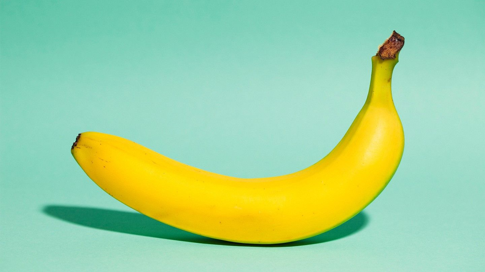

# XAI-Adversarial-Patch

This project demonstrates the creation of an adversarial patch and its impact on a deep learning model. The patch has been tested on the ResNet34 architecture, with the target class chosen as "banana."

## Overview

Adversarial patches are small images that can cause deep learning models to misclassify the input when placed on another image. Unlike traditional pixel-based adversarial attacks, these patches are universal (work on any image) and are printable in the real world.

## Requirements

- Python 3.10+
- PyTorch
- torchvision
- numpy 
- matplotlib
- seaborn
- tqdm
- PyTorch Lightning

You can install the required packages using:

```bash
pip install torch torchvision numpy matplotlib seaborn tqdm pytorch-lightning
```

## Project Structure

The code is organized as follows:

- Uses ResNet-34 pretrained on ImageNet as the target model
- Implements patch attack training on TinyImageNet dataset
- Supports multiple patch sizes (32x32, 48x48, 64x64)
- Includes visualization utilities for patches and their effects

## Key Components

### Main Functions

1. `place_patch(img, patch)`: Places the adversarial patch at random locations on input images
2. `patch_attack(model, target_class, patch_size, num_epochs)`: Trains an adversarial patch to target a specific class
3. `eval_patch(model, patch, val_loader, target_class)`: Evaluates patch effectiveness
4. `show_patches()`: Visualizes trained adversarial patches

### Model Setup

The code uses a pretrained ResNet-34 model:

```python
pretrained_model = torchvision.models.resnet34(weights='IMAGENET1K_V1')
```

### Training Process

The patch training process:
1. Initializes a randomly-sized patch
2. Places it randomly on input images
3. Optimizes the patch to maximize the probability of the target class
4. Validates performance on a held-out set

## Usage

1. Load the pretrained model and dataset:
```python
pretrained_model = torchvision.models.resnet34(weights='IMAGENET1K_V1')
dataset = torchvision.datasets.ImageFolder(root=imagenet_path, transform=plain_transforms)
```

2. Train patches for target classes:
```python
class_names = ['banana']  # Add more class names as needed
patch_sizes = [32, 48, 64]
patch_dict = get_patches(class_names, patch_sizes)
```

3. Visualize results:
```python
show_patches()
```

## Results

The code includes evaluation metrics:
- Top-1 accuracy: Percentage of images correctly classified as the target class
- Top-5 accuracy: Percentage of images where target class appears in top 5 predictions

Example results for 'banana' class:
- 32x32 patch: 2.16% success rate
- 48x48 patch: 86.40% success rate
- 64x64 patch: 93.64% success rate

## Implementation Details

The attack uses several key techniques:
- Random patch placement during training for robustness
- Tanh transformation to ensure valid pixel values
- Cross-entropy loss optimization
- SGD optimizer with momentum
- Multiple random placements during evaluation

## Best Practices

1. Use multiple patch sizes to understand size-effectiveness tradeoff
2. Evaluate on held-out validation set
3. Test patches with multiple random placements
4. Save and load trained patches for reproducibility

## Notes

- Larger patches generally achieve higher success rates
- The attack is non-targeted for non-target class images
- Results may vary based on target class and model architecture
- Consider ethical implications when using adversarial attacks

## Limitations

- Only tested on ResNet-34
- Limited to 2D image classification
- Requires relatively large patch sizes for high success rates
- May not transfer well to other models or real-world scenarios

- 
## Additional Component

In addition to the adversarial patch, the Fast Gradient Sign Method (FGSM) was employed to distort a separate image of a banana. The results are displayed to illustrate how FGSM attacks manipulate the input to deceive the model.

## Image, before and after FGSM Distortion.


.png)
